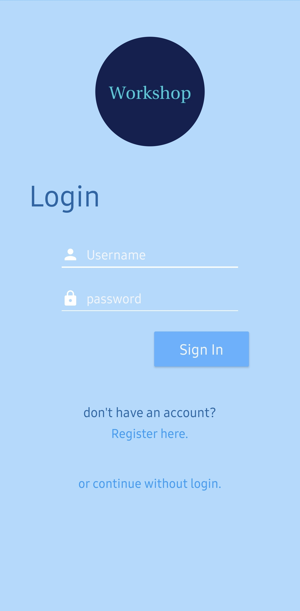
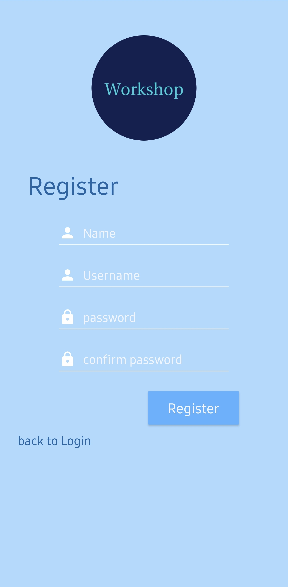
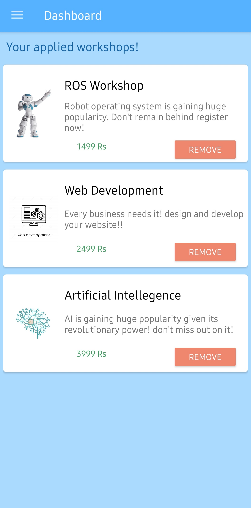
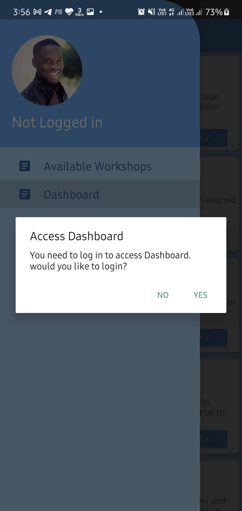
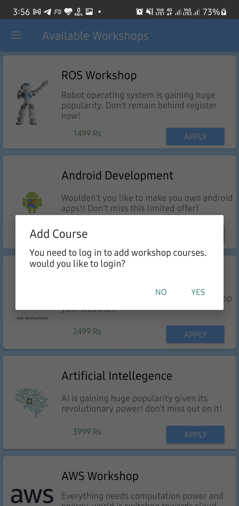
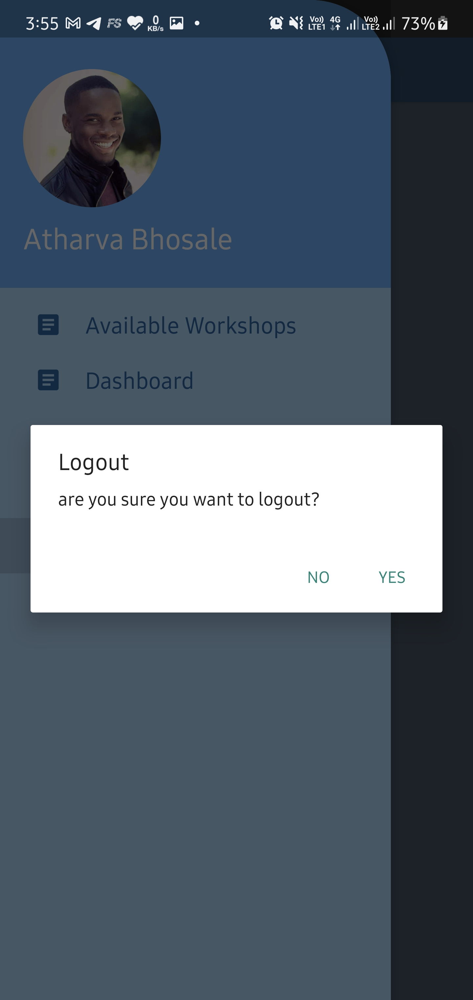

# MyWorkshops
an app to browse and apply to workshop or courses..

### It features
- Login and register
- available workshops' browsing
- Dashboard - to view existing registered workshops
- It supports multiple users and uses SQLite database to keep track of their data
- Smooth, user friendly UX and UI (smooth, using time delayed algorithms and Coroutines)

### highlighting use of android features like
- SQlite(Room) Database
- Kotlin Coroutines
- Activities, fragments
- Shared Prefrences

# APP

## Login & Register
- login allows existing users to Sign into their account and Register alows new users to Sign up for services

    

## Navigation
- Navigation drawer for easy access of services

## Workshops and subcribed Workshops(Dashboard)
- Shows available workshops to all users and Dashboard to existing users

    

## Alert Features
- Uses alert dialoguebox in many situations

        

### ---Done--

